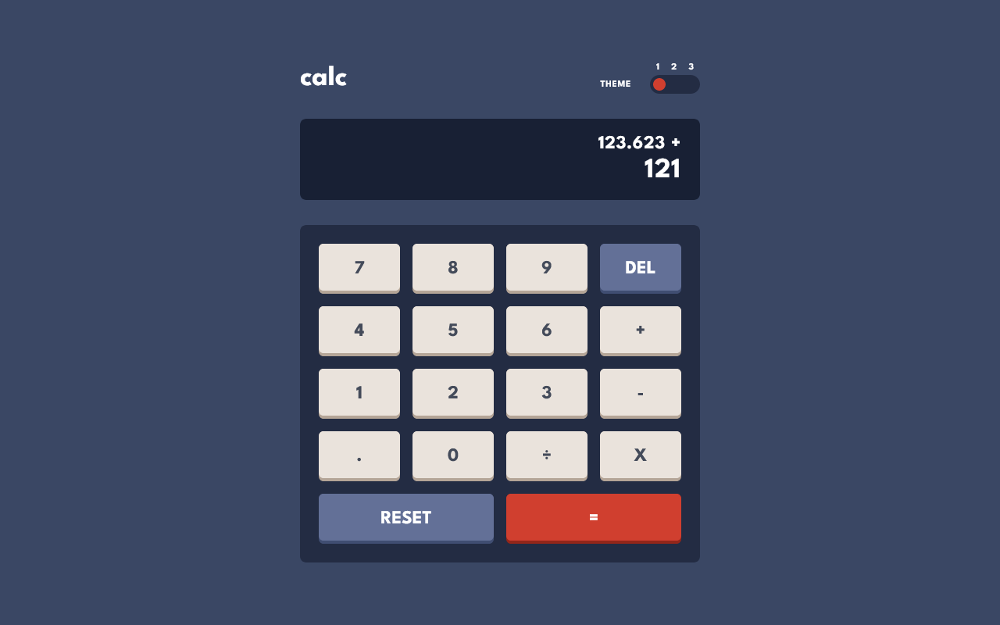
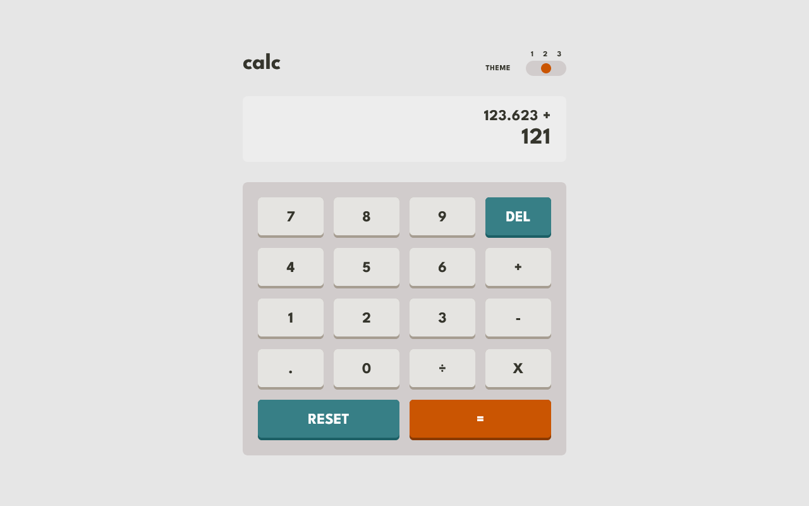
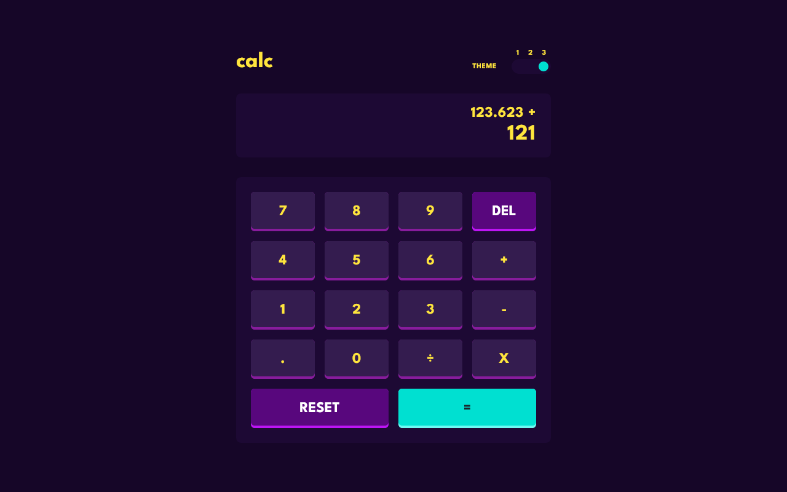
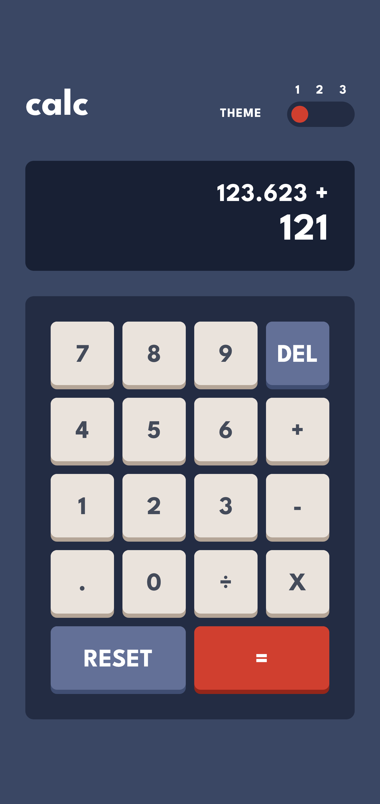

# Frontend Mentor - Calculator app solution

This is a solution to the [Calculator app challenge on Frontend Mentor](https://www.frontendmentor.io/challenges/calculator-app-9lteq5N29).

## Table of contents

- [Overview](#overview)
  - [The challenge](#the-challenge)
  - [Screenshot](#screenshot)
  - [Links](#links)
- [My process](#my-process)
  - [Built with](#built-with)
  - [What I learned](#what-i-learned)
  - [Useful resources](#useful-resources)
- [Author](#author)

## Overview

### The challenge

Users should be able to:

- See the size of the elements adjust based on their device's screen size
- Perform mathmatical operations like addition, subtraction, multiplication, and division
- Adjust the color theme based on their preference
- **Bonus**: Have their initial theme preference checked using `prefers-color-scheme` and have any additional changes saved in the browser
- **Bonus 2**: Use the calculator with keyboard (Digits "1-9" & "." - Operations - Backspace - Equal sign - Delete)

### Screenshot









### Links

- Solution URL: [Go to solution](https://www.frontendmentor.io/solutions/calculator-app-sveltekit-tailwind-ts-w-keyboard-navigation-ptjGsSScdG)
- Live Site URL: [Go to live site](https://calculator-app-zeta-nine.vercel.app/)

## My process

### Built with

- Semantic HTML5 markup
- CSS custom properties
- Flexbox
- CSS Grid
- Secure cookies for SSR theming (prevent flashing happening w/ client side theming).
- [SvelteKit](https://kit.svelte.dev/) - JS framework w/ SSR (Server-Side Rendering)
- [TailwindCss](https://tailwindcss.com/) - Utility-first CSS framework
- [Typescript](https://www.typescriptlang.org/) - Strongly typed JS

### What I learned

I chose to handle the theme with **SSR & cookies** to prevent the screen from flashing when the user's theme is different from the default theme of the app.

#### The problem I tried to solve

When using a _class/data-attributes_ & _localStorage_ method to update the theme, the app will always load with the default theme and then update it when the data has been loaded from the storage.

This behavior causes a small but noticable "flashing" on the screen each time the app reloads if the user's theme is not the default theme.

#### How I solved it

- I get the theme cookie before each request and put it in the event locals.

```ts
// src/hooks/index.ts
import type { Handle } from "@sveltejs/kit";
import { getCookieValue, isTheme } from "$lib/helpers";
import type { ThemeStore } from "$lib/types";

const getThemeFromCookie = (cookie: string | null) => {
  const json = getCookieValue(cookie, "theme");
  const themeStore = json ? (JSON.parse(json) as ThemeStore) : null;
  return themeStore && isTheme(themeStore.theme) ? themeStore : null;
};

export const handle: Handle = async ({ event, resolve }) => {
  const cookie = event.request.headers.get("cookie");
  event.locals.themeStore = getThemeFromCookie(cookie);
  const response = await resolve(event);
  return response;
};
```

- I load the value of the theme in the layout

```ts
// src/routes/+layout.server.ts
import type { ServerLoad } from "@sveltejs/kit";
export const load: ServerLoad = async ({ locals }) => {
  return {
    themeStore: locals.themeStore,
  };
};
```

- I store the value in a local store where i check for the user's prefers-color-scheme

```ts
// src/routes/+layout.svelte
<script lang="ts">
  // imports
  export let data: { themeStore: ThemeStore | null };
  $: initTheme(data.themeStore);
</script>

// src/lib/stores/theme.ts
export const initTheme = (value: ThemeStore | null) => {
  if (value) {
    if (browser && value.usePrefers) {
      const theme: Theme = window.matchMedia("(prefers-color-scheme: dark)").matches ? "dark" : "light";
      const store: ThemeStore = { ...value, theme };
      // Update the cookie is prefers-color-scheme changed in between sessions
      if (theme !== value.theme) saveStoreInCookie(store);
      themeStore.set(store);
    } else {
      themeStore.set(value);
    }
  } else if (browser) {
    const theme: Theme = window.matchMedia("(prefers-color-scheme: dark)").matches ? "dark" : "light";
    const store: ThemeStore = { theme, usePrefers: true };
    themeStore.set(store);
    saveStoreInCookie(store);
  } else {
    themeStore.set(defaultThemeStore);
  }
};
```

- I use a PUT method to save the new value of the cookie each time it is changed

```ts
// src/routes/theme/+server.ts
import type { RequestHandler } from "@sveltejs/kit";
import { updateCookie } from "$lib/helpers";

export const PUT: RequestHandler = async ({ request, setHeaders }) => {
  const theme = await request.text();
  setHeaders({ "Set-Cookie": updateCookie("theme", theme) });
  return new Response(theme);
};

// src/lib/stores/theme.ts
const saveStoreInCookie = (store: ThemeStore) => fetch("/theme", { method: "PUT", body: JSON.stringify(store) });

export const updateTheme = (store: ThemeStore) => {
  themeStore.set(store);
  saveStoreInCookie(store);
};
```

**And there you go. Your SSR theme handling has been setup!**

#### Why it is not a perfect solution

Unfortunatly you'll will always have this "flashing effect" on the first ever load because you need to check for the **prefers-color-scheme** value of the user before setting up the cookie AND maybe sometimes after if the user changed this setting in between two sessions.

But i think that it's already a big improvement and it gave me a good opportunity to learn SvelteKit's hooks & the new routing system.

### Useful resources

- [KeyEvent Values](https://www.freecodecamp.org/news/javascript-keycode-list-keypress-event-key-codes/#a-full-list-of-key-event-values) - List of EVENT.KEY values.
- [SvelteKit Hooks](https://kit.svelte.dev/docs/hooks#handle) - Runs everytime SveleKit receives a request.
- [SvelteKit New Routing](https://kit.svelte.dev/docs/routing) - Updated docs for Routing.

## Author

- Frontend Mentor - [@AntoineC-dev](https://www.frontendmentor.io/profile/AntoineC-dev)
